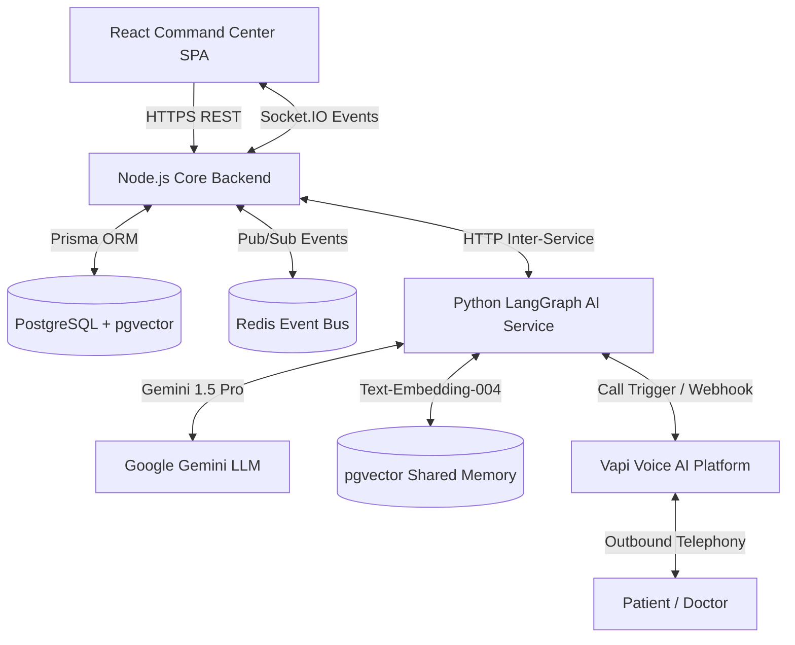
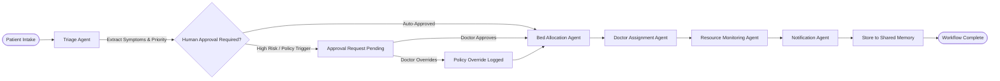
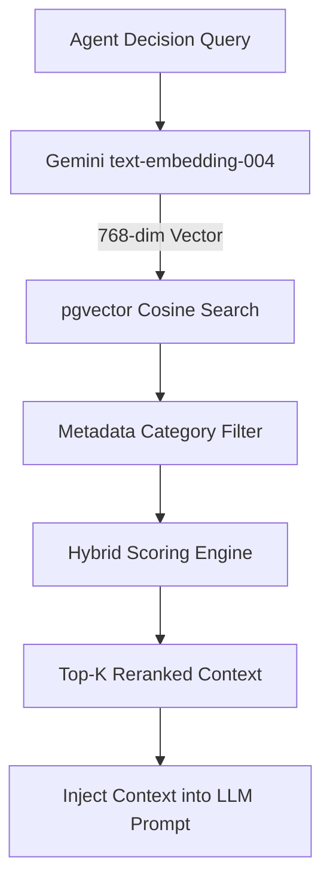
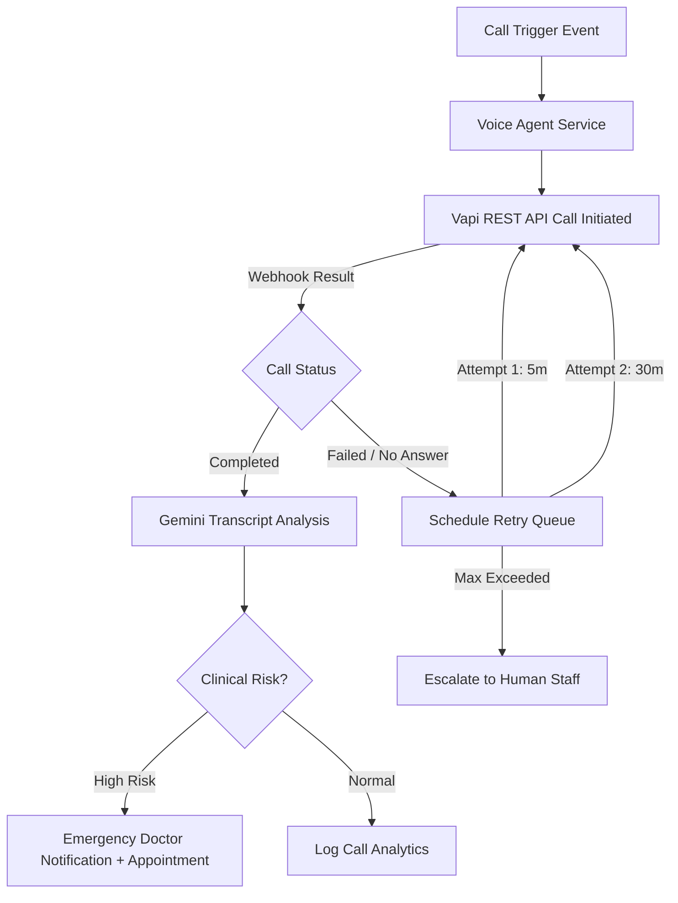
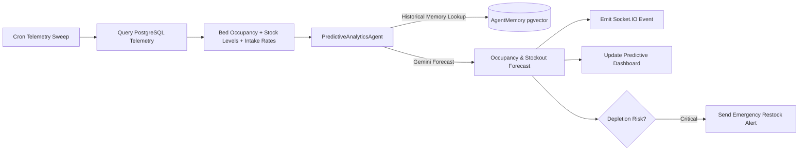
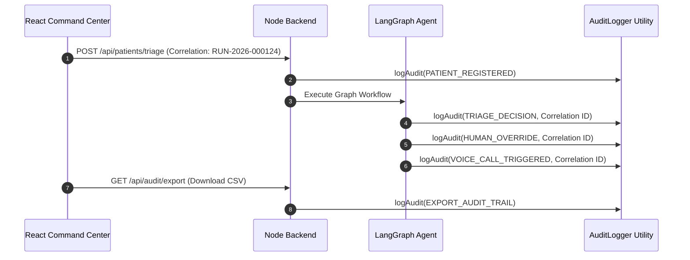
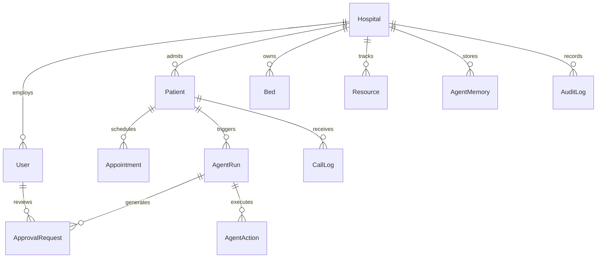

# MediAgent AI — System Architecture & Technical Design

This document details the high-level architecture, multi-agent workflows, data models, event orchestration, and security mechanisms powering **MediAgent AI**, an enterprise-grade autonomous hospital operations platform.

---

## 🏢 System Architecture Overview

MediAgent AI utilizes an **Event-Driven Microservices Architecture** split into four core runtime layers:
1. **Frontend Command Center**: React SPA (Vite) with real-time Socket.IO subscriptions and dynamic dashboards.
2. **Node.js Core Backend**: Express REST API, Prisma ORM, JWT multi-tenant auth, RBAC middleware, and scheduled cron jobs.
3. **Python AI Agent Service**: FastAPI backend powering LangGraph multi-agent state machines, Gemini 1.5 Pro LLM reasoning, and pgvector embeddings.
4. **Data & Telemetry Layer**: PostgreSQL (Neon with `pgvector`), Redis Event Bus (pub/sub & state queues), and Vapi Voice Telephony.

---

## 🤖 LangGraph Multi-Agent Workflows

### 1. Patient Triage & Admission State Machine
When a patient presents at triage, the autonomous agent graph executes sequentially with human intervention checkpoints:

---

## 🧠 Shared Agent Memory (pgvector Architecture)

All autonomous agents retrieve historical context prior to decision making and persist structured learnings afterward using a hybrid vector scoring model.

### Hybrid Retrieval Scoring Formula:
$$\text{Score} = (\text{Similarity} \times 0.45) + (\text{Importance} \times 0.25) + (\text{Recency Weight} \times 0.20) + (\text{Confidence} \times 0.10)$$

---

## 📞 Voice AI Service & Retry Pipeline

Outbound call triggers (upcoming appointment reminders, post-discharge check-ins) are handled asynchronously via Vapi with automated exponential retries and transcript analysis.

---

## 🔮 Predictive Operational Analytics Pipeline

Every 15 minutes, scheduled cron workers perform hospital-wide telemetry sweeps to project 24h occupancy and resource depletion count-downs.

---

## 🛡️ Governance & Audit Trail (Correlation ID Tracing)

Every execution across the platform receives a unique **Correlation ID** (e.g. `RUN-2026-000124`) that binds all downstream sub-events together in a tamper-resistant append-only log.

---

## 🗄️ Database ER Diagram (Core Models)

